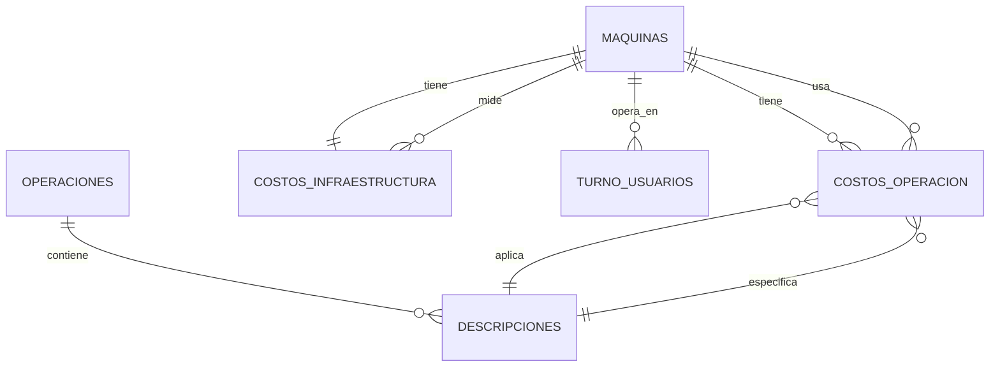

# Módulo de Costos - Documentación Completa

**Fecha:** 30 de Enero, 2026  
**Sistema:** Inducolma - Gestión Industrial  
**Módulo:** Costos Operacionales e Infraestructura

---

## 📋 Tabla de Contenidos

1. [Visión General del Módulo](#visión-general-del-módulo)
2. [Arquitectura del Sistema](#arquitectura-del-sistema)
3. [Controladores del Módulo](#controladores-del-módulo)
4. [Flujo de Datos Completo](#flujo-de-datos-completo)
5. [Modelos y Relaciones](#modelos-y-relaciones)
6. [Rutas del Módulo](#rutas-del-módulo)
7. [Casos de Uso](#casos-de-uso)

---

## Visión General del Módulo

### Propósito
El módulo de Costos gestiona toda la estructura de costos operacionales e infraestructura de la empresa, permitiendo:
- Definir máquinas y sus costos operativos
- Categorizar operaciones y sus descripciones
- Asignar costos específicos por máquina-operación
- Establecer estándares de producción (unidades/minuto)

### Componentes Principales

```
📦 MÓDULO DE COSTOS
├── 🔧 Máquinas (equipos productivos)
├── 📋 Operaciones (categorías de trabajo)
├── 📝 Descripciones (detalles de operaciones)
├── 💰 Costos de Operación (valores específicos)
└── 🏭 Costos de Infraestructura (estándares de producción)
```

---

## Arquitectura del Sistema

### Jerarquía de Datos

```
┌─────────────────────────────────────────────────────────────┐
│                     NIVEL 1: CATÁLOGOS                      │
├─────────────────┬───────────────────────┬───────────────────┤
│    Máquinas     │     Operaciones       │   TiposMadera     │
│  (Recursos)     │    (Categorías)       │   (Materiales)    │
└────────┬────────┴──────────┬────────────┴──────────┬────────┘
         │                   │                        │
         ▼                   ▼                        │
┌─────────────────┐  ┌─────────────────┐            │
│                 │  │                 │             │
│  Maquina        │  │   Operacion     │             │
│  ├─ maquina     │  │   └─ operacion  │             │
│  └─ corte       │  │                 │             │
│                 │  │                 │             │
└─────────┬───────┘  └─────────┬───────┘             │
          │                    │                      │
          │                    ▼                      │
          │          ┌──────────────────┐            │
          │          │  Descripcion     │            │
          │          │  ├─ descripcion  │            │
          │          │  └─ operacion_id │            │
          │          └─────────┬────────┘            │
          │                    │                      │
┌─────────▼────────────────────▼──────────────────────┘
│              NIVEL 2: COSTOS Y CONFIGURACIÓN          
├──────────────────────────┬────────────────────────────┐
│   CostosOperacion        │  CostosInfraestructura     │
│   ├─ cantidad            │  ├─ maquina_id             │
│   ├─ valor_mes           │  ├─ tipo_material          │
│   ├─ valor_dia           │  ├─ tipo_madera            │
│   ├─ costo_kwh           │  └─ estandar_u_minuto      │
│   ├─ maquina_id          │                            │
│   └─ descripcion_id      │                            │
└──────────────────────────┴────────────────────────────┘
```

### Flujo de Dependencias

```
1. MAQUINA + OPERACION → Bases independientes
   ↓
2. OPERACION → DESCRIPCION (hija de operación)
   ↓
3. MAQUINA + DESCRIPCION → COSTO OPERACION
   ↓
4. MAQUINA + TIPO_MADERA → COSTO INFRAESTRUCTURA
```

---

## Controladores del Módulo

### 1. MaquinaController ✅ Documentado

**Archivo:** `app/Http/Controllers/MaquinaController.php`  
**Propósito:** Gestionar el catálogo de máquinas productivas

#### Funcionalidades
- ✅ Listar máquinas
- ✅ Crear máquinas con tipo de corte
- ✅ Editar máquinas
- ✅ Eliminar (valida relaciones)

#### Rutas
```php
GET    /costos-maquina              → index()
POST   /costos-maquina              → store()
GET    /costos-maquina/{id}/edit    → edit()
PATCH  /costos-maquina/{id}         → update()
DELETE /costos-maquina/{id}         → destroy()
```

#### Campos
- `maquina`: Nombre de la máquina (VARCHAR, MAYÚSCULAS)
- `corte`: Tipo de corte (ENUM: INICIAL, INTERMEDIO, FINAL, etc.)

#### Relaciones
- `hasMany`: costos_operacion
- `hasOne`: costos_infraestructura
- `belongsToMany`: turnos, users

📄 **Documentación completa:** [MaquinaController.md](./MaquinaController.md)

---

### 2. OperacionController ✅ Documentado

**Archivo:** `app/Http/Controllers/OperacionController.php`  
**Propósito:** Gestionar categorías de operaciones (ASERRADO, ENSAMBLE, etc.)

#### Funcionalidades
- ✅ Listar operaciones
- ✅ Crear operaciones
- ✅ Editar operaciones
- ✅ Eliminar (valida que no tenga descripciones)

#### Rutas
```php
GET    /costos-operacion            → index()
POST   /costos-operacion            → store()
GET    /costos-operacion/{id}/edit  → edit()
PATCH  /costos-operacion/{id}       → update()
DELETE /costos-operacion/{id}       → destroy()
```

#### Campos
- `operacion`: Nombre de la operación (VARCHAR, MAYÚSCULAS)

#### Relaciones
- `hasMany`: descripciones

📄 **Documentación completa:** [OperacionController.md](./OperacionController.md)

---

### 3. DescripcionController ✅ Documentado

**Archivo:** `app/Http/Controllers/DescripcionController.php`  
**Propósito:** Gestionar descripciones específicas dentro de operaciones

#### Funcionalidades
- ✅ Listar descripciones con sus operaciones
- ✅ Crear descripciones asociadas a operación
- ✅ Editar descripciones (puede cambiar operación padre)
- ✅ Eliminar (valida que no tenga costos)

#### Rutas
```php
GET    /costos-descripcion            → index()
POST   /costos-descripcion            → store()
GET    /costos-descripcion/{id}/edit  → edit()
PATCH  /costos-descripcion/{id}       → update()
DELETE /costos-descripcion/{id}       → destroy()
```

#### Campos
- `descripcion`: Texto de la descripción (VARCHAR, MAYÚSCULAS)
- `operacion_id`: FK a operaciones (BIGINT)

#### Relaciones
- `belongsTo`: operacion (padre)
- `hasMany`: costos_operacion (hijos)

📄 **Documentación completa:** [DescripcionController.md](./DescripcionController.md)

---

### 4. CostosOperacionController

**Archivo:** `app/Http/Controllers/CostosOperacionController.php`  
**Propósito:** Gestionar costos específicos por máquina-descripción

#### Funcionalidades
- ✅ Listar costos operacionales
- ✅ Crear costos con múltiples valores
- ✅ Editar costos
- ✅ Eliminar costos
- ✅ AJAX: Cargar descripciones por operación

#### Rutas
```php
GET    /costos-de-operacion              → index()
POST   /costos-de-operacion              → store()
GET    /costos-de-operacion/{id}/edit    → edit()
PATCH  /costos-de-operacion/{id}         → update()
DELETE /costos-de-operacion/{id}         → destroy()
POST   /descripciones                    → descripciones() [AJAX]
```

#### Campos Principales
- `cantidad`: Cantidad de unidades (INTEGER)
- `valor_mes`: Costo mensual (DECIMAL)
- `valor_dia`: Costo diario (DECIMAL)
- `costo_kwh`: Costo por kilowatt-hora (DECIMAL)
- `maquina_id`: FK a maquinas (BIGINT)
- `descripcion_id`: FK a descripciones (BIGINT)

#### Relaciones
- `belongsTo`: maquina
- `belongsTo`: descripcion (y a través de ella, operacion)

#### Método Especial: descripciones()

**Propósito:** API para cargar descripciones dinámicamente según operación seleccionada

```php
public function descripciones(Request $request)
{
    $this->authorize('admin');
    
    // Obtiene descripciones filtradas por operación
    $operaciones = Descripcion::where('operacion_id', $request->idOperacion)->get();
    
    // Retorna JSON para consumo con JavaScript
    return response()->json($operaciones);
}
```

**Uso en Frontend:**
```javascript
// Cuando usuario selecciona una operación
$('#selectOperacion').change(function() {
    let operacionId = $(this).val();
    
    // AJAX para obtener descripciones
    $.post('/descripciones', {
        idOperacion: operacionId,
        _token: $('meta[name="csrf-token"]').attr('content')
    }, function(descripciones) {
        // Llenar select de descripciones
        $('#selectDescripcion').empty();
        descripciones.forEach(desc => {
            $('#selectDescripcion').append(
                `<option value="${desc.id}">${desc.descripcion}</option>`
            );
        });
    });
});
```

---

### 5. CostosInfraestructuraController

**Archivo:** `app/Http/Controllers/CostosInfraestructuraController.php`  
**Propósito:** Gestionar estándares de producción (unidades por minuto)

#### Funcionalidades
- ✅ Listar estándares
- ✅ Crear estándares por máquina-material
- ✅ Editar estándares
- ✅ Eliminar estándares

#### Rutas
```php
GET    /costos-de-infraestructura              → index()
POST   /costos-de-infraestructura              → store()
GET    /costos-de-infraestructura/{id}/edit    → edit()
PATCH  /costos-de-infraestructura/{id}         → update()
DELETE /costos-de-infraestructura/{id}         → destroy()
```

#### Campos Principales
- `maquina_id`: FK a maquinas (BIGINT)
- `tipo_material`: Tipo de material (VARCHAR: 'MADERA', 'ITEM')
- `tipo_madera`: Código del tipo de madera (VARCHAR)
- `estandar_u_minuto`: Unidades producidas por minuto (DECIMAL)

#### Relaciones
- `belongsTo`: maquina
- Relación implícita con TipoMadera a través de `tipo_madera`

#### Características Especiales

**Validación en Store:**
```php
if($estandarUnidadesMinuto->wasRecentlyCreated){
    return back()->with('status', 'Estandar de unidades por minuto creado con éxito');
}
return back()->with('status', 'Algo salio mal');
```

**Uso de ::create() con validación:**
- Usa asignación masiva (`::create()`)
- Verifica si se creó exitosamente
- Retorna mensajes diferentes según resultado

---

## Flujo de Datos Completo

### Escenario: Crear Costo Operacional Completo

#### Paso 1: Configurar Máquina
```
Usuario → /costos-maquina
→ Crea "SIERRA CIRCULAR"
→ Tipo: "INICIAL"
→ Guardado ✅ (maquina_id: 1)
```

#### Paso 2: Configurar Operación
```
Usuario → /costos-operacion
→ Crea "ASERRADO"
→ Guardado ✅ (operacion_id: 1)
```

#### Paso 3: Crear Descripción
```
Usuario → /costos-descripcion
→ Selecciona operación: "ASERRADO"
→ Ingresa: "CORTE INICIAL"
→ Guardado ✅ (descripcion_id: 1, operacion_id: 1)
```

#### Paso 4: Asignar Costo
```
Usuario → /costos-de-operacion
→ Selecciona máquina: "SIERRA CIRCULAR"
→ Selecciona operación: "ASERRADO"
→ AJAX carga descripciones de ASERRADO
→ Selecciona descripción: "CORTE INICIAL"
→ Ingresa valores:
    cantidad: 2
    valor_mes: 500000
    valor_dia: 16666.67
    costo_kwh: 450
→ Guardado ✅ (costos_operacion_id: 1)
```

#### Paso 5: Configurar Estándar de Producción
```
Usuario → /costos-de-infraestructura
→ Selecciona máquina: "SIERRA CIRCULAR"
→ Tipo material: "MADERA"
→ Tipo madera: "PINO"
→ Estándar: 5.5 unidades/minuto
→ Guardado ✅ (costos_infraestructura_id: 1)
```

### Resultado Final en BD

```sql
-- Tabla: maquinas
id | maquina         | corte
1  | SIERRA CIRCULAR | INICIAL

-- Tabla: operaciones
id | operacion
1  | ASERRADO

-- Tabla: descripciones
id | descripcion    | operacion_id
1  | CORTE INICIAL  | 1

-- Tabla: costos_operacion
id | cantidad | valor_mes | valor_dia | costo_kwh | maquina_id | descripcion_id
1  | 2        | 500000    | 16666.67  | 450       | 1          | 1

-- Tabla: costos_infraestructura
id | maquina_id | tipo_material | tipo_madera | estandar_u_minuto
1  | 1          | MADERA        | PINO        | 5.5
```

---

## Modelos y Relaciones

### Diagrama ER Completo



### Consultas Complejas Útiles

#### 1. Costo total de una máquina
```php
$maquina = Maquina::with('costos_operacion')->find(1);
$costoTotal = $maquina->costos_operacion->sum('valor_dia');
```

#### 2. Todas las descripciones con sus costos
```php
$descripcion = Descripcion::with([
    'operacion',
    'costos_operacion.maquina'
])->find(1);
```

#### 3. Operaciones completas con estructura
```php
$operaciones = Operacion::with([
    'descripciones.costos_operacion.maquina'
])->get();
```

#### 4. Máquinas con todos sus costos
```php
$maquina = Maquina::with([
    'costos_operacion.descripcion.operacion',
    'costos_infraestructura'
])->find(1);
```

#### 5. Estándares de producción por tipo de madera
```php
$estandares = CostosInfraestructura::where('tipo_madera', 'PINO')
    ->with('maquina')
    ->get();
```

---

## Rutas del Módulo

### Resumen de Endpoints

| Recurso | GET (Index) | POST (Store) | GET (Edit) | PATCH (Update) | DELETE (Destroy) |
|---------|-------------|--------------|------------|----------------|------------------|
| Máquinas | ✅ | ✅ | ✅ | ✅ | ✅ |
| Operaciones | ✅ | ✅ | ✅ | ✅ | ✅ |
| Descripciones | ✅ | ✅ | ✅ | ✅ | ✅ |
| Costos Operación | ✅ | ✅ | ✅ | ✅ | ✅ |
| Costos Infraestructura | ✅ | ✅ | ✅ | ✅ | ✅ |

### Rutas Especiales

#### AJAX: Cargar Descripciones
```php
POST /descripciones
{
    "idOperacion": 1
}
```
**Respuesta:**
```json
[
    {
        "id": 1,
        "descripcion": "CORTE INICIAL",
        "operacion_id": 1
    },
    {
        "id": 2,
        "descripcion": "DIMENSIONADO",
        "operacion_id": 1
    }
]
```

---

## Casos de Uso

### Caso 1: Calcular Costo de Producción

**Objetivo:** Calcular el costo de producir 100 piezas

```php
// 1. Obtener el costo operacional
$costo = CostosOperacion::where('maquina_id', 1)
    ->where('descripcion_id', 1)
    ->first();

// 2. Obtener el estándar de producción
$estandar = CostosInfraestructura::where('maquina_id', 1)
    ->where('tipo_madera', 'PINO')
    ->first();

// 3. Calcular tiempo necesario
$unidadesProducir = 100;
$unidadesPorMinuto = $estandar->estandar_u_minuto; // 5.5
$minutosNecesarios = $unidadesProducir / $unidadesPorMinuto; // 18.18 minutos

// 4. Calcular costo
$costoPorDia = $costo->valor_dia; // 16666.67
$minutosEnDia = 8 * 60; // 480 minutos (jornada de 8 horas)
$costoPorMinuto = $costoPorDia / $minutosEnDia; // 34.72
$costoTotal = $costoPorMinuto * $minutosNecesarios; // 631.17

echo "Costo de producir 100 piezas: $" . number_format($costoTotal, 2);
// Output: Costo de producir 100 piezas: $631.17
```

### Caso 2: Comparar Eficiencia de Máquinas

**Objetivo:** Determinar qué máquina es más eficiente para producir pino

```php
$estandares = CostosInfraestructura::where('tipo_madera', 'PINO')
    ->with('maquina')
    ->orderBy('estandar_u_minuto', 'desc')
    ->get();

foreach ($estandares as $est) {
    echo "{$est->maquina->maquina}: {$est->estandar_u_minuto} u/min\n";
}

// Output:
// SIERRA AUTOMATICA: 8.5 u/min
// SIERRA CIRCULAR: 5.5 u/min
// SIERRA MANUAL: 3.2 u/min
```

### Caso 3: Reporte de Costos por Operación

**Objetivo:** Listar todos los costos de una operación específica

```php
$operacion = Operacion::with([
    'descripciones.costos_operacion.maquina'
])->find(1);

echo "OPERACIÓN: {$operacion->operacion}\n";
echo str_repeat("-", 50) . "\n";

foreach ($operacion->descripciones as $desc) {
    echo "  {$desc->descripcion}\n";
    
    foreach ($desc->costos_operacion as $costo) {
        echo "    - {$costo->maquina->maquina}: ${$costo->valor_dia}/día\n";
    }
}

// Output:
// OPERACIÓN: ASERRADO
// --------------------------------------------------
//   CORTE INICIAL
//     - SIERRA CIRCULAR: $16666.67/día
//     - SIERRA AUTOMATICA: $25000.00/día
//   DIMENSIONADO
//     - DIMENSIONADORA: $18500.00/día
```

---

## Seguridad y Autorización

### Nivel de Acceso

**Todos los controladores requieren:**
```php
$this->authorize('admin');
```

**Implementación en AuthServiceProvider:**
```php
Gate::define('admin', function ($user) {
    return $user->role === 'admin';
});
```

### Protección CSRF

Todas las rutas POST, PATCH, DELETE requieren token CSRF:
```blade
@csrf
@method('PATCH')
```

### Validación de Datos

Cada controlador usa FormRequests específicos para validar:
- `StoreMaquinaRequest`
- `StoreOperacionRequest`
- `StoreDescripcionRequest`
- `StoreCostosOperacionRequest`
- `StoreCostosInfraestructuraRequest`

---

## Performance y Optimización

### Problemas Comunes

#### 1. N+1 Query Problem

**Problema en index():**
```php
// ❌ Malo: genera N+1 queries
$descripciones = Descripcion::all();
foreach ($descripciones as $desc) {
    echo $desc->operacion->operacion; // Query extra por cada descripción
}
```

**Solución:**
```php
// ✅ Bueno: usa eager loading
$descripciones = Descripcion::with('operacion')->all();
foreach ($descripciones as $desc) {
    echo $desc->operacion->operacion; // Sin query extra
}
```

#### 2. Selects Sin Límite

**Problema:**
```php
// ❌ Carga todas las operaciones aunque solo se usen 10
$operaciones = Operacion::all();
```

**Solución:**
```php
// ✅ Solo las necesarias para el select
$operaciones = Operacion::orderBy('operacion')->get(['id', 'operacion']);
```

### Índices Recomendados

```sql
-- Índices en llaves foráneas
CREATE INDEX idx_descripciones_operacion_id ON descripciones(operacion_id);
CREATE INDEX idx_costos_operacion_maquina_id ON costos_operacion(maquina_id);
CREATE INDEX idx_costos_operacion_descripcion_id ON costos_operacion(descripcion_id);
CREATE INDEX idx_costos_infraestructura_maquina_id ON costos_infraestructura(maquina_id);

-- Índices compuestos para búsquedas frecuentes
CREATE INDEX idx_costos_infra_maquina_madera 
    ON costos_infraestructura(maquina_id, tipo_madera);
```

---

## Testing del Módulo

### Suite de Tests Propuesta

```php
// tests/Feature/ModuloCostosTest.php
class ModuloCostosTest extends TestCase
{
    /** @test */
    public function flujo_completo_creacion_costo()
    {
        // 1. Crear máquina
        $maquina = Maquina::factory()->create();
        
        // 2. Crear operación
        $operacion = Operacion::factory()->create();
        
        // 3. Crear descripción
        $descripcion = Descripcion::factory()->create([
            'operacion_id' => $operacion->id
        ]);
        
        // 4. Crear costo
        $costo = CostosOperacion::factory()->create([
            'maquina_id' => $maquina->id,
            'descripcion_id' => $descripcion->id
        ]);
        
        // Verificar relaciones
        $this->assertTrue($costo->maquina->is($maquina));
        $this->assertTrue($costo->descripcion->is($descripcion));
        $this->assertTrue($costo->descripcion->operacion->is($operacion));
    }
}
```

---

## Documentación de Referencia

### Controladores Documentados

1. ✅ [MaquinaController.md](./MaquinaController.md)
2. ✅ [OperacionController.md](./OperacionController.md)
3. ✅ [DescripcionController.md](./DescripcionController.md)
4. ⏳ CostosOperacionController.md (En proceso)
5. ⏳ CostosInfraestructuraController.md (En proceso)

### Tests Documentados

1. ✅ [MaquinaControllerTest.md](../tests/MaquinaControllerTest.md)
2. ⏳ OperacionControllerTest.md (Pendiente)
3. ⏳ DescripcionControllerTest.md (Pendiente)

### Vistas Documentadas

1. ✅ [Vista_Maquinas.md](../vistas/Vista_Maquinas.md)
2. ⏳ Vista_Operaciones.md (Pendiente)
3. ⏳ Vista_Descripciones.md (Pendiente)

---

**Última actualización:** 30 de Enero, 2026  
**Versión:** 1.0  
**Estado:** En desarrollo  
**Autor:** Sistema de Documentación Inducolma
